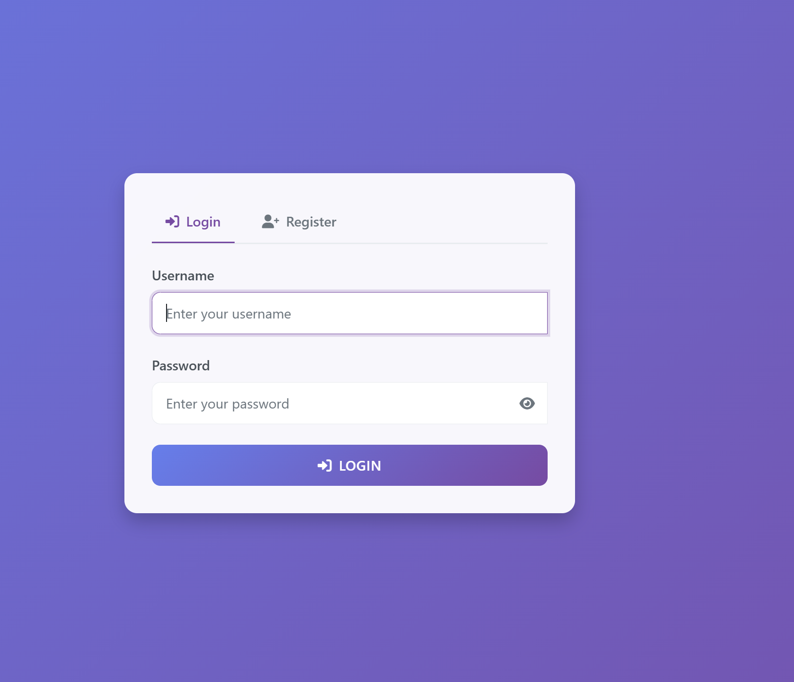
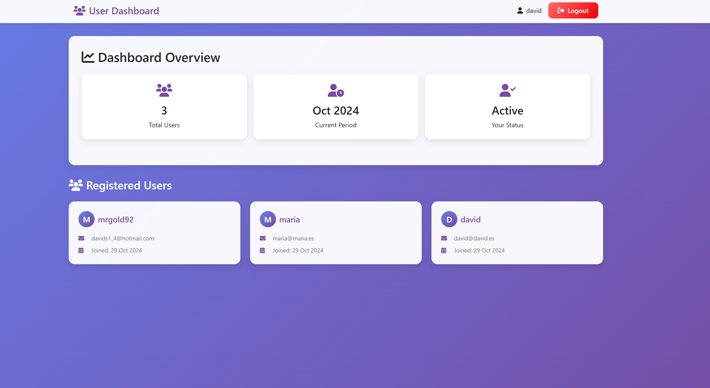
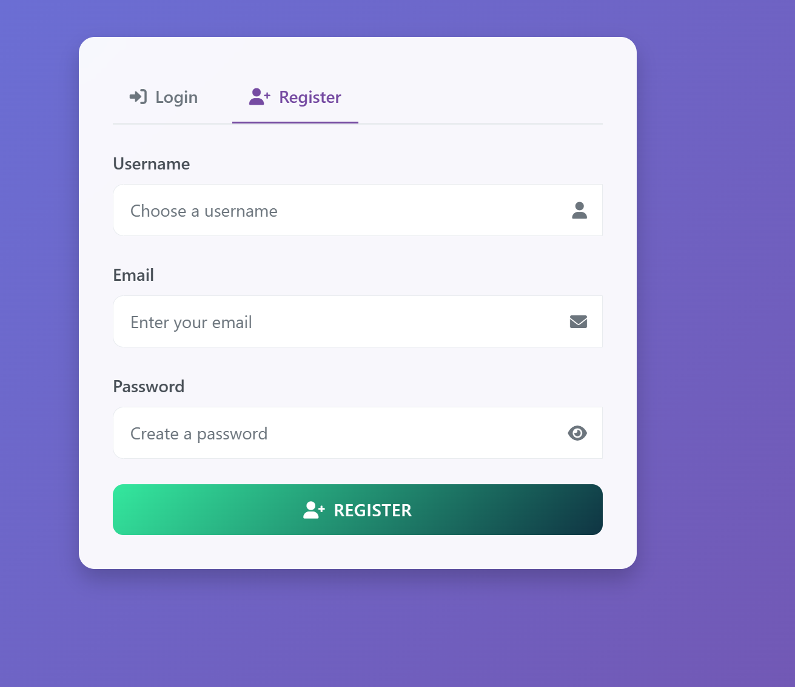
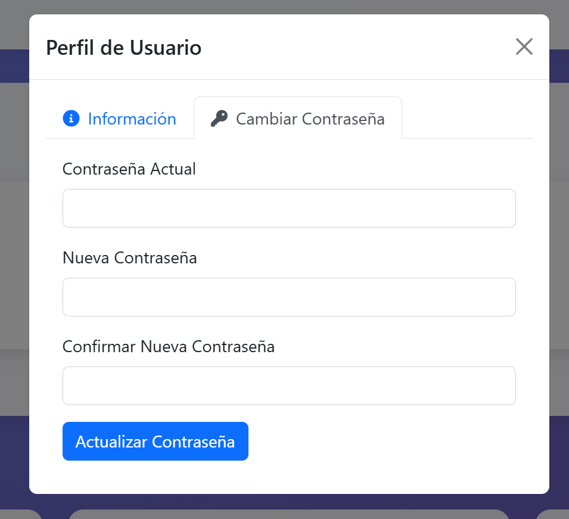

# Sistema de Login con PHP & MySQL

Proyecto para la asignatura de Aplicaciones Basadas en Tecnologías Web de la Universitat Carlemany. Sistema moderno y seguro de login/registro construido con PHP, MySQL y Bootstrap 5, con una interfaz de usuario moderna.







## Características

- 🔐 Sistema de Autenticación Seguro
  - Encriptación de contraseñas usando password_hash().
  - Gestión de sesiones.
  - Protección contra inyección SQL con prepared statements.
  - Protección XSS con htmlspecialchars().
  - Validación de datos de entrada.

- 🎨 Interfaz de Usuario Moderna.
  - Diseño responsive.
  - Animaciones suaves.
  - Elementos interactivos.
  - Componentes Bootstrap 5.
  - Sistema de notificaciones para feedback.

- 👥 Gestión de Usuarios.
  - Registro de usuarios.
  - Login de usuarios.
  - Gestión de perfil de usuario.
  - Cambio de contraseña.
  - Visualización de todos los usuarios.
  - Control de sesiones.

- 🔧 Características Técnicas
  - Contenedores con Docker.
  - Base de datos MariaDB.
  - PHP 7.4.
  - phpMyAdmin incluido.

## Requisitos Previos

- Docker.
- Docker Compose.

## Instalación

1. Clonar el repositorio.
2. Iniciar los contenedores.
```bash
docker compose up -d
```
3. Acceder a la aplicación.
- Aplicación Web: http://localhost:8080
- phpMyAdmin: http://localhost:8081
  - Servidor: db
  - Usuario: root
  - Contraseña: secret


## Configuración Docker

El proyecto utiliza tres contenedores Docker:

1. **Servidor Web (PHP & Apache)**
   - PHP 7.4 con Apache.
   - Extensiones personalizadas instaladas (mysqli).
   - Sirve la aplicación PHP.

2. **Base de Datos (MariaDB)**
   - MariaDB 10.3.
   - Almacenamiento persistente de datos.
   - Configuración segura de contraseña.

3. **phpMyAdmin**
   - Interfaz de gestión de base de datos.
   - Administración fácil de la base de datos.
   - Conectado al contenedor MariaDB.

## Características de Seguridad

- Contraseñas hasheadas usando `password_hash()` de PHP.
- Protección básica XSS usando `htmlspecialchars()`.
- Todas las consultas utilizan prepared statements.
- Autenticación básica basada en sesiones.

## Características de la Interfaz

- Diseño moderno.
- Diseño responsive para todos los dispositivos.
- Animaciones interactivas en las tarjetas.
- Toggle de visibilidad de contraseña.
- Feedback de validación de formularios.
- Transiciones suaves entre páginas.
- Avatares de usuario con iniciales.
- Interfaz limpia e intuitiva.

## Desarrollo

Para modificar la aplicación:

1. Los archivos PHP están en el directorio `php/`.
2. La configuración de la base de datos está en `config.php`.
3. Las funciones de base de datos están en `db_functions.php`.
4. El manejo de errores está en `errors.php`.

## Créditos

- [Bootstrap 5](https://getbootstrap.com/).
- [Font Awesome](https://fontawesome.com/).
- [Docker](https://www.docker.com/).


---
Desarrollado por David Salazar Rodero para la asignatura de Aplicaciones Basadas en Tecnologías Web - Universitat Carlemany.
